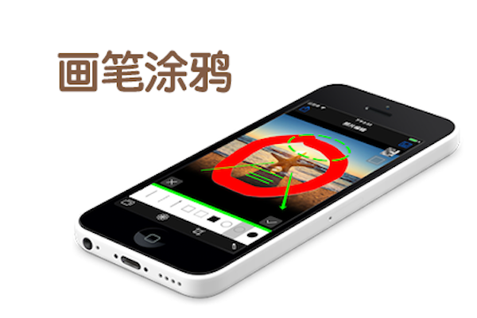

PhotoDIY
==========
照片DIY

AppStore地址：

## 预览效果图

## 优化点
1. 预览模式时，添加可左右滑动选择预览图片；
2. 滤镜优化；
3. 选择不同尺寸图片预览时，大小位置加载不对；

##介绍方案
照片DIY是一款处理照片的App，除了可以对照片进入各种翻转、剪裁、缩放，添加文字等基本操作；
还可以添加各种可调节的滤镜操作以及在各种涂鸦和画笔操作等；

PhotoDIY is a photo processing App, in addition to the photo into a variety of flip, cut, zoom, add text and other basic operations;
You can also add a variety of adjustable filter operation and in a variety of graffiti and brush operations;

* [Facebook分享申请流程](http://bbs.mob.com/thread-19148-1-1.html)：`http://bbs.mob.com/thread-19148-1-1.html`

##本地化文案
1.内购产品说明

- 简体中文
收费功能开通券
高级功能永久开放使用券

- 繁体中文
收費功能開通券
高級功能永久開放使用券

- 日语
充電機能オープンチケット
高度な機能永久にオープンバウチャー

- 韩语
충전 기능 오픈 티켓
고급 기능을 영구적으로 개방 쿠폰

- 英语
Charge Function Pass
Premium features and function are permanently open for Pass

- 俄语
Функция заряда активируется купоны
Расширенные функциональные возможности постоянно открытые ваучеры

- 法语
La fonction de charge est coupons activés
Fonctions avancées bons ouverts en permanence

- 德语
Ladefunktion ist aktiviert Coupons
Erweiterte Funktionen permanent offene Gutscheine

- 西班牙语
Billete abierto Función de carga
Las características avanzadas vales permanentemente abiertas

